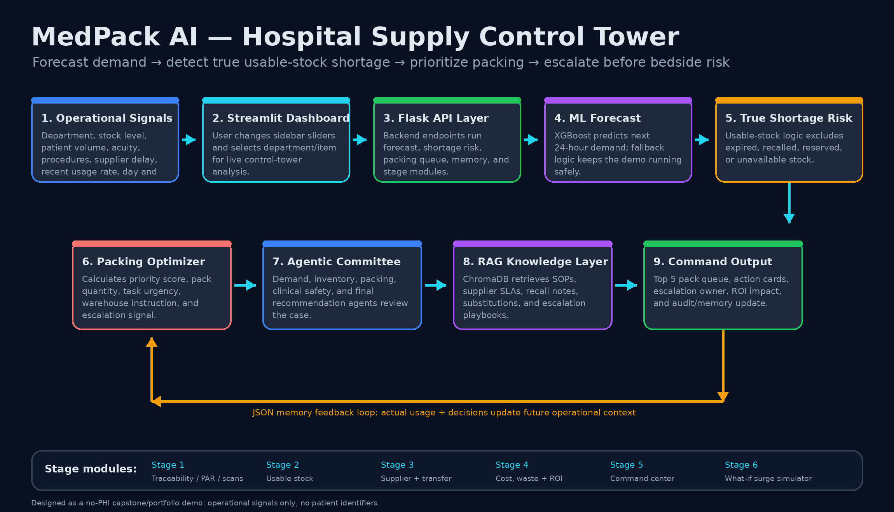
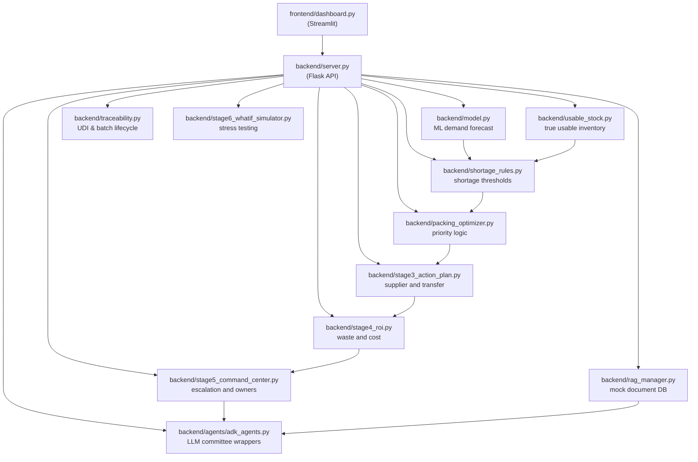

# MedPack AI

## Hospital Supply Shortage Prediction & Packing Priority Control Tower

**MedPack AI** predicts hospital supply demand, detects true shortage risk, and turns that risk into a warehouse packing and escalation plan before the shortage reaches the bedside.

It combines a **Streamlit dashboard**, **Flask API**, **XGBoost/fallback machine-learning forecast**, **usable-stock shortage rules**, **packing optimization**, **RAG-backed SOP guidance**, **JSON memory**, and an **agentic decision committee**.



---

## The Problem

Hospitals can have enough staff and still break operationally if critical supplies are not available where and when they are needed.

A supply shortage can create delays in:

- IV access
- wound care
- PPE availability
- oxygen delivery
- catheter use
- telemetry monitoring
- emergency department flow
- surgery and ICU readiness

In practice, nurses and techs lose time hunting for supplies, substituting items, escalating to supervisors, or waiting on central supply. That delay becomes a patient-flow and patient-safety problem.

**MedPack AI tackles this by connecting demand forecasting directly to warehouse action.**

Instead of only saying, “this item may run short,” the system answers:

> What item is at risk, where is it needed, how urgent is it, how much should we pack, what backup actions exist, and when should we escalate?

---

## What the System Does

MedPack AI converts hospital operational telemetry into a control-tower decision packet.

```text
Hospital operational signals
        ↓
24-hour demand forecast
        ↓
Usable-stock shortage-risk analysis
        ↓
Packing priority optimizer
        ↓
RAG-supported agent committee
        ↓
Command-center action plan
        ↓
JSON memory / audit feedback loop
```

The output is not just a prediction. It is a practical recommendation for a hospital supply room, warehouse, command center, or operations team.

---

## Core Features

- **24-hour supply demand forecasting** using XGBoost, with fallback logic so the demo remains stable.
- **True usable-stock analysis** that excludes expired, recalled, task-reserved, unsafe, or unavailable inventory.
- **Shortage-risk classification** into `Low`, `Medium`, `High`, and `Critical`.
- **Packing-priority optimizer** that ranks supplies by shortage gap, clinical criticality, acuity, supplier delay, usage rate, pack time, and department importance.
- **Top 5 Supplies to Pack First** queue driven by the backend pipeline.
- **Stage 1 traceability layer** for lot, UDI, barcode, expiration, recall, scan event, PAR, and packing task lifecycle logic.
- **Stage 2 usable-stock control** so the app does not falsely approve stock that is technically present but operationally unavailable.
- **Stage 3 supplier/transfer intelligence** to evaluate internal transfers, supplier risk, and substitute options.
- **Stage 4 cost, waste, and ROI executive dashboard** for shortage dollars at risk, waste exposure, emergency-order premium, carrying cost, and value impact.
- **Stage 5 agentic command center** that converts analysis into priority codes, owners, escalation windows, action cards, and audit checklist.
- **Stage 6 what-if surge simulator** for ED surge, ICU spike, flu season, supplier delay, mass casualty mode, weekend constraint, and surgery schedule spike.
- **RAG knowledge layer** using ChromaDB-backed SOPs, supplier SLAs, recall notes, substitution rules, and escalation policies.
- **Agentic decision committee** for demand, inventory risk, packing priority, clinical safety, and final recommendation.
- **Local zero-token mode** by default, with optional remote LLM mode for Groq/Gemini summaries.
- **No-PHI design** using operational signals only.

---

## How the Data Flows

### 1. Operational Inputs

The dashboard collects or simulates hospital supply-chain signals:

- department
- item name and item category
- current stock
- patient volume
- acuity level
- procedure count
- recent usage rate
- supplier delay
- reorder point
- supplier reliability
- clinical criticality
- pack time
- day, hour, and season

### 2. Forecasting Layer

`backend/model.py` predicts `actual_usage_next_24h`.

The preferred model is **XGBoost**. If XGBoost or the saved model is not available, the project falls back safely so the dashboard can still run as a portfolio demo.

### 3. Shortage-Risk Layer

`backend/shortage_rules.py` compares forecast demand against available stock.

Stage 2 improves this by using **usable stock**, not just raw inventory.

```text
usable_stock = total_stock - expired_stock - recalled_stock - reserved_stock - unsafe_stock
shortage_gap = predicted_24h_demand - usable_stock
coverage_ratio = usable_stock / predicted_24h_demand
```

This matters because a hospital may appear to have stock in the database while the real usable quantity is much lower.

### 4. Packing Optimization Layer

`backend/packing_optimizer.py` and `backend/packing_queue.py` turn shortage risk into action:

- priority score
- recommended pack quantity
- estimated warehouse work
- escalation flag
- plain-English packing instruction
- Top 5 queue ranking

### 5. RAG + Agentic Decision Layer

`backend/rag_manager.py` loads mock operational knowledge into ChromaDB.

The knowledge base includes examples such as:

- supply-room SOPs
- supplier service-level agreements
- recall warnings
- substitution guidance
- escalation rules
- department-specific policies

The agent committee can retrieve this context and use it to explain decisions. This is useful because a hospital supply decision is not only numerical. It may depend on policies such as:

- “Do not use recalled stock.”
- “Do not substitute this item in the ICU.”
- “Escalate when coverage falls below a critical threshold.”
- “Use internal transfer before paying emergency supplier premium.”

### 6. Memory Feedback Loop

`backend/supply_memory.py` stores operational memory in JSON files:

```text
database/supply_memory_state.json
database/supply_memory_events.jsonl
```

This lets the system remember rolling usage, trend direction, prediction deltas, and prior decisions.

---

## Agentic AI Design

The agentic committee is designed to behave like a hospital operations huddle.

| Agent | Responsibility |
|---|---|
| Demand Forecast Agent | Interprets the 24-hour demand prediction. |
| Inventory Risk Agent | Checks true usable stock and shortage gap. |
| Packing Priority Agent | Converts risk into pack quantity and queue priority. |
| Clinical Safety Agent | Explains patient-flow and bedside risk. |
| Final Recommendation Agent | Produces the final action plan. |
| Committee Summarizer | Condenses the decision into an executive summary. |

By default, this is deterministic and local, so it costs **zero LLM tokens**.

Remote LLM mode is optional and only runs when explicitly configured.

```env
DEFAULT_AGENT_MODE=local
USE_LLM_AGENTS=false
```

---

## App Architecture



---

## Screenshots

To showcase the system for a portfolio, we recommend saving your screenshots to a `docs/` folder and linking them here:

- `` - *Show the main supply list and telemetry panel.*
- `` - *Show the Final Recommendation Agent and RAG injection.*
- `` - *Show the Stage 4 ROI metrics.*

---

## Key API Endpoints

| Endpoint | Method | Purpose |
|---|---:|---|
| `/health` | GET | Backend health check |
| `/api/inventory` | GET | Inventory snapshot |
| `/api/packing-queue` | GET/POST | Ranked supplies to pack first |
| `/api/predict-supply-demand` | POST | 24-hour supply demand forecast |
| `/api/shortage-risk` | POST | Shortage-risk classification |
| `/api/usable-stock-analysis` | POST | Stage 2 true usable-stock analysis |
| `/api/packing-priority` | POST | Packing recommendation |
| `/api/run-medpack-committee` | POST | Full committee pipeline |
| `/api/run-medpack-committee-fast` | POST | Fast local committee packet |
| `/api/supply-memory` | GET | Current memory state |
| `/api/update-supply-memory` | POST | Update memory from actual usage |
| `/api/compliance-alerts` | GET/POST | PAR, expiry, recall, and cold-chain alerts |
| `/api/scan-event` | POST | Simulate barcode/UDI stock movement |
| `/api/par-recommendation` | POST | Dynamic PAR/max-stock recommendation |
| `/api/packing-tasks` | GET/POST/PATCH | Packing task lifecycle |
| `/api/transfer-recommendation` | POST | Stage 3 internal transfer recommendation |
| `/api/supplier-risk` | POST | Stage 3 supplier-risk analysis |
| `/api/substitute-options` | POST | Stage 3 substitute supply options |
| `/api/stage4-roi-analysis` | POST | Cost, waste, and ROI analysis |
| `/api/stage5-command-center` | POST | Final command-center packet |
| `/api/stage6-whatif-simulator` | POST | Surge/stress-test simulation |

---

## Data Design

The project uses no-PHI operational data.

Example data locations:

```text
database/raw/kaggle_hospital_supply_chain.csv
database/processed/medpack_training_data.csv
database/inventory_state.json
database/vendor_state.json
database/substitution_rules.json
database/escalation_playbooks.json
database/scenario_playbooks.json
database/cost_assumptions.json
```

The app can run with synthetic data. If a Kaggle-style hospital supply-chain CSV is available, the loader maps available fields and fills gaps needed for the simulation.

---

## No-PHI Guardrail

MedPack AI is built as an operational decision-support simulation. It does **not** require or store:

- patient names
- patient IDs
- medical record numbers
- addresses
- phone numbers
- individual diagnoses
- individual medical histories

It only uses high-level operational signals such as department, patient volume, acuity level, procedure count, stock level, and usage rate.

---

## How to Run Locally

### Windows quick start

Use the launcher at the project root:

```bat
RUN_ME.bat
```

This installs dependencies, prepares data/model assets if needed, starts the Flask backend, and starts the Streamlit dashboard.

### Manual run

Install dependencies:

```bash
pip install -r requirements.txt
```

Run the local orchestrator:

```bash
python app.py
```

Open:

```text
Dashboard: http://127.0.0.1:8502
Backend:   http://127.0.0.1:5001/health
```

### Debug mode on Windows

```bat
RUN_BACKEND.bat
RUN_FRONTEND.bat
```

### Run tests

```bash
pytest
```

or on Windows:

```bat
RUN_TESTS.bat
```

---

## Deployment Notes

MedPack AI is designed for a split frontend/backend deployment.

### Backend service

Typical health check:

```text
/health
```

### Frontend service

Set the frontend environment variable to the deployed backend URL:

```env
MEDPACK_API_BASE_URL=https://YOUR-BACKEND-DOMAIN
```

See [`DEPLOYMENT.md`](DEPLOYMENT.md) for a fuller cloud deployment guide.

---

## Why This Is Useful as a Portfolio Project

This project demonstrates more than a basic dashboard.

It shows how to combine:

- machine learning
- rules-based safety logic
- healthcare operations thinking
- supply-chain prioritization
- agentic AI
- RAG
- simulation
- API design
- frontend/backend deployment
- memory and auditability

The strongest point is that the system does not stop at prediction. It pushes the prediction into an operational decision:

> forecast → risk → queue → escalation → audit trail

That is the difference between a model demo and a workflow demo.

---

## Future Work

High-value next improvements:

1. **Real hospital supply-chain data integration** from ERP, inventory, scan, and purchasing feeds.
2. **Live barcode/UDI integration** with real scanner events instead of simulated movement.
3. **More realistic forecasting** using time-series features, holidays, department-specific seasonality, and backtesting.
4. **Model monitoring** with forecast error, drift detection, and confidence bands.
5. **Role-based views** for warehouse staff, charge nurse, supply-chain manager, and executive leadership.
6. **Automated escalation workflow** through Slack, Teams, email, or ticketing systems.
7. **Better RAG knowledge ingestion** from real SOP PDFs, supplier contracts, recall bulletins, and policy manuals.
8. **Optimization under constraints** such as limited staff, limited carts, limited shift time, and competing urgent requests.
9. **Simulation history** so what-if scenarios can be compared over time.
10. **Deployment hardening** with authentication, logging, rate limits, secrets management, and production database storage.
11. **Production Vector Database**: We currently use a lightweight in-memory string-matching search for RAG to bypass free-tier PaaS (e.g., Railway) memory limits. A production iteration would re-introduce ChromaDB, Pinecone, or Weaviate for large-scale SOP ingestion.

---

## Suggested Project Title

**MedPack AI: Predicting Hospital Supply Shortages and Prioritizing Warehouse Packing Before Bedside Risk**

---

## Portfolio Pitch

**MedPack AI is an agentic hospital supply-chain control tower.**

It predicts which supplies may run short in the next 24 hours, checks the true usable inventory, ranks what the warehouse should pack first, retrieves relevant SOP/recall/substitution guidance through RAG, and produces a final command-center recommendation with escalation logic.

The goal is simple:

> Keep nurses at the bedside by making sure the right supplies are packed, staged, transferred, or escalated before the shortage becomes a clinical bottleneck.
