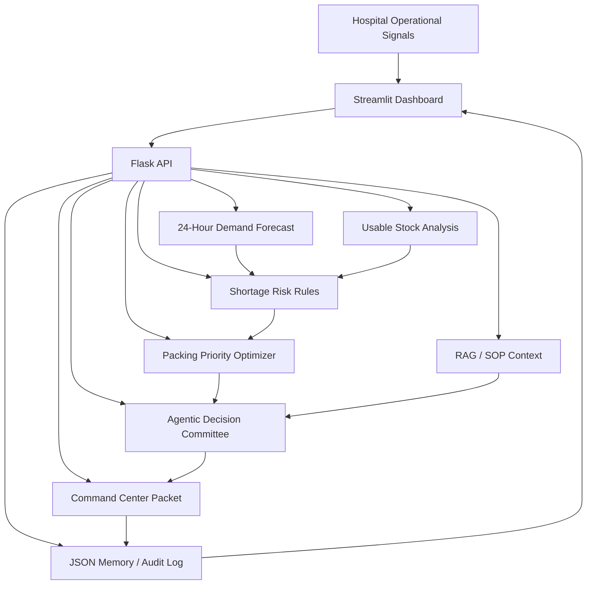
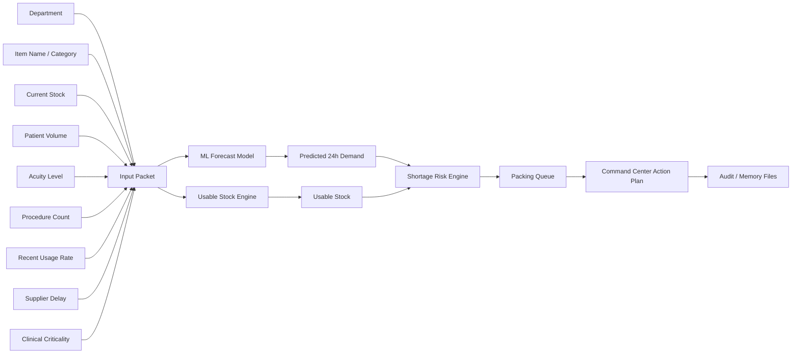
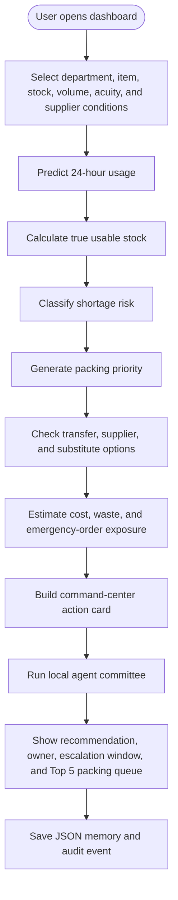
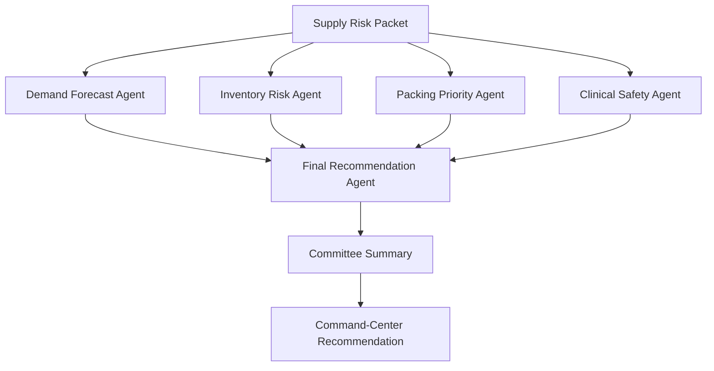
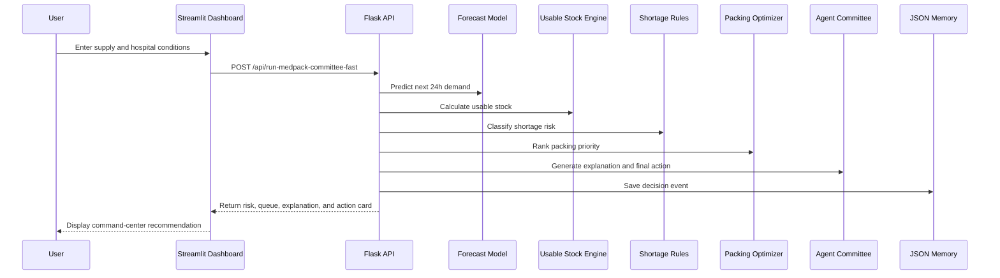
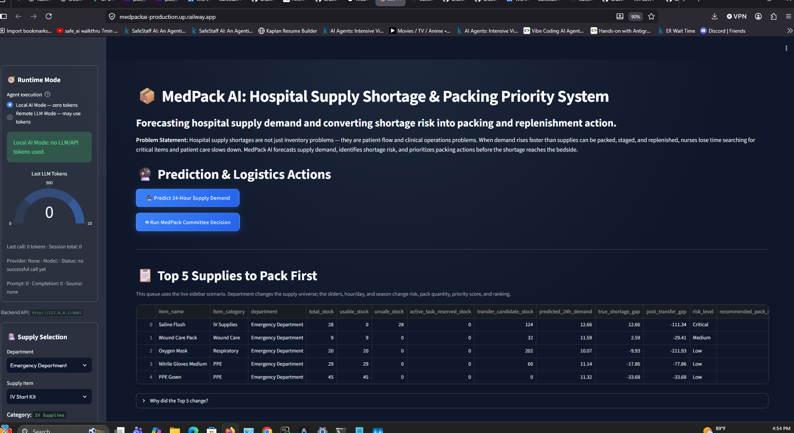
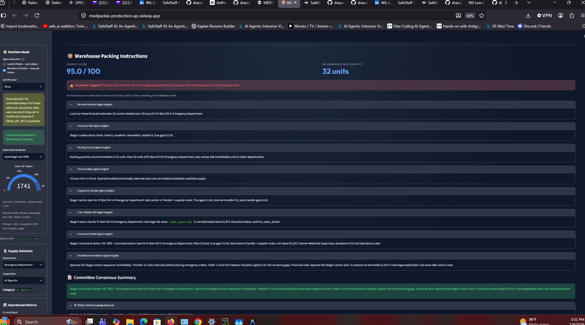
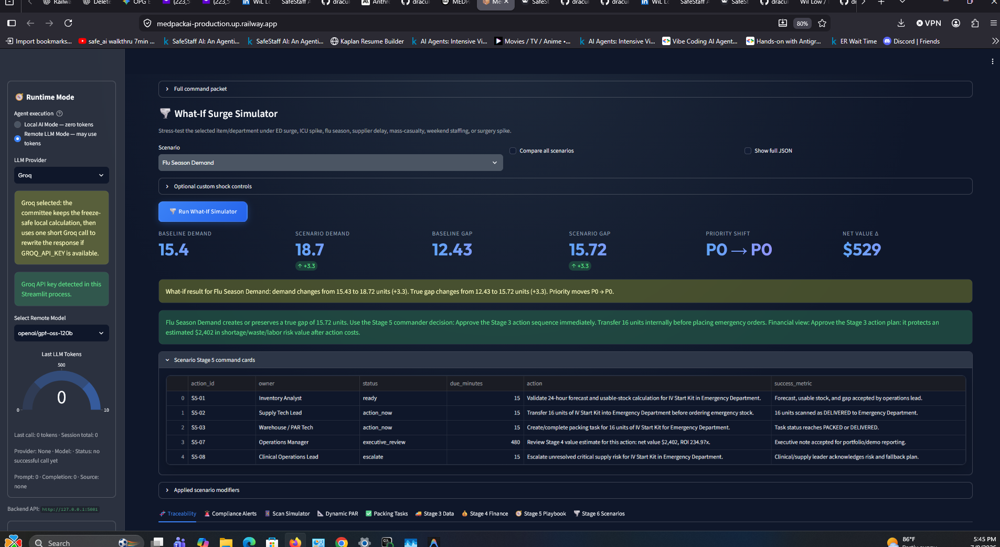
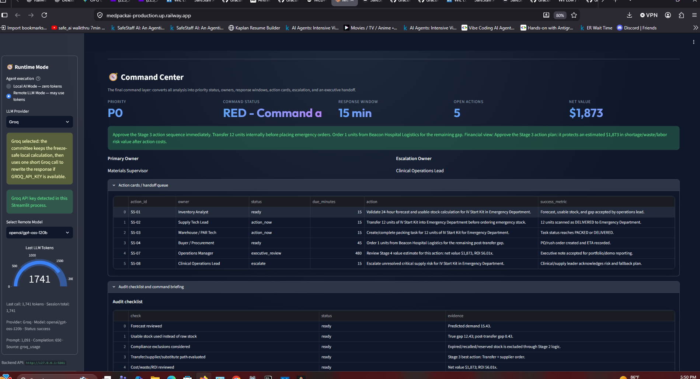

# MedPack AI

## Agentic Hospital Supply Shortage Prediction & Packing Priority Control Tower

**MedPack AI** predicts which hospital supplies may run short in the next 24 hours, checks whether the stock is truly usable, ranks what the warehouse should pack first, and generates a command-center action plan before the shortage reaches the bedside.

It combines a **Streamlit dashboard**, **Flask API**, **machine-learning demand forecast**, **usable-stock rules**, **packing optimization**, **RAG-style SOP guidance**, **JSON memory**, and a **local zero-token agentic decision committee**.

> **Core idea:** MedPack AI does not stop at prediction. It turns prediction into operational action.

```text
forecast -> shortage risk -> packing queue -> escalation plan -> audit memory
```

---

## Why This Matters

Hospitals can have enough staff and still slow down if critical supplies are missing, expired, recalled, reserved, or stuck in the wrong location.

A supply shortage can delay:

- IV access
- wound care
- PPE availability
- oxygen delivery
- catheter use
- telemetry monitoring
- emergency department flow
- surgery and ICU readiness

In real operations, nurses and techs may lose time hunting for supplies, substituting items, calling supervisors, or waiting for central supply. MedPack AI is designed to catch those risks early and push the answer into a warehouse-ready action plan.

Instead of only answering:

> “Will we run short?”

MedPack AI answers:

> “What item is at risk, where is it needed, how urgent is it, how much should we pack, what backup options exist, who owns the action, and when should we escalate?”

---

## Project Snapshot

| Area | What MedPack AI Does |
|---|---|
| **Forecasting** | Predicts next-24-hour supply usage using XGBoost/fallback ML logic. |
| **Inventory safety** | Checks true usable stock, excluding expired, recalled, unsafe, or reserved inventory. |
| **Shortage risk** | Classifies supply risk as Low, Medium, High, or Critical. |
| **Packing priority** | Ranks what the warehouse should pack first based on shortage gap, clinical criticality, acuity, supplier delay, and pack time. |
| **Agentic AI** | Runs a local deterministic agent committee to explain demand, inventory risk, packing priority, clinical safety, and final action. |
| **RAG-style guidance** | Uses SOP, recall, substitution, and escalation context to explain recommendations. |
| **Command center** | Produces owner, priority code, escalation window, action card, and audit checklist. |
| **Simulation** | Stress-tests the plan under ED surge, ICU spike, supplier delay, flu season, weekend constraint, mass casualty mode, and surgery spike. |
| **Memory** | Stores rolling usage, prediction deltas, and decision events in JSON. |
| **Privacy** | Uses no PHI. It works on operational supply-chain signals only. |

---

## Architecture Overview



---

## Beginner-Friendly Explanation

Think of MedPack AI like a hospital supply-room control tower.

1. The dashboard asks for hospital conditions: department, item, stock level, patient volume, acuity, recent usage, supplier delay, and other operational signals.
2. The backend predicts how much of that item may be needed in the next 24 hours.
3. The system checks how much stock is actually usable, not just how much appears in the inventory database.
4. It calculates the shortage gap and risk level.
5. It ranks which supplies should be packed first.
6. It checks simulated SOP, recall, supplier, substitute, and escalation guidance.
7. It produces a command-center recommendation: pack, transfer, substitute, escalate, monitor, or reorder.
8. It saves a memory/audit event so the system can track what happened later.

---

## End-to-End Data Flow



---

## Main Application Pipeline



---

## Code Architecture

```mermaid
graph TD
    UI[frontend/dashboard.py<br/>Streamlit UI] --> API[backend/server.py<br/>Flask API]

    API --> Model[backend/model.py<br/>Demand Forecast]
    API --> Shortage[backend/shortage_rules.py<br/>Risk Classification]
    API --> Usable[backend/usable_stock.py<br/>True Usable Inventory]
    API --> Packing[backend/packing_optimizer.py<br/>Packing Recommendation]
    API --> Queue[backend/packing_queue.py<br/>Top 5 Queue]
    API --> Trace[backend/traceability.py<br/>UDI / Lot / Expiry Logic]

    API --> Transfer[backend/transfer_optimizer.py<br/>Internal Transfer]
    API --> Supplier[backend/supplier_risk.py<br/>Supplier Delay Risk]
    API --> Substitute[backend/substitution_engine.py<br/>Substitute Options]
    API --> ROI[backend/stage4_roi.py<br/>Cost / Waste / ROI]
    API --> Command[backend/stage5_command_center.py<br/>Action Cards / Escalation]
    API --> WhatIf[backend/stage6_whatif_simulator.py<br/>Surge Simulator]

    API --> RAG[backend/rag_manager.py<br/>SOP / Recall / SLA Context]
    API --> Agents[backend/agents/adk_agents.py<br/>Agent Wrappers]
    API --> Fast[backend/fast_committee.py<br/>Fast Local Committee]
    API --> Memory[backend/supply_memory.py<br/>JSON Memory]
```



---

## Stage-by-Stage System Design

| Stage | Name | Purpose |
|---:|---|---|
| **1** | Traceability Layer | Adds lot, UDI, barcode, expiration, recall, PAR, and packing-task lifecycle logic. |
| **2** | Usable-Stock Control | Prevents the system from approving stock that exists on paper but is expired, recalled, unsafe, reserved, or unavailable. |
| **3** | Supplier / Transfer Intelligence | Checks supplier risk, internal transfers, emergency ordering, and substitute supply options. |
| **4** | Cost, Waste, and ROI | Estimates shortage dollars at risk, waste exposure, emergency premium, carrying cost, and executive value impact. |
| **5** | Agentic Command Center | Converts analysis into priority codes, owners, escalation windows, action cards, and audit checklists. |
| **6** | What-If Simulator | Stress-tests the system under surge and disruption scenarios. |

---

## Agentic Decision Committee

The local agent committee is designed to behave like a hospital operations huddle.



| Agent | Responsibility |
|---|---|
| **Demand Forecast Agent** | Explains the predicted next-24-hour demand. |
| **Inventory Risk Agent** | Checks usable stock, shortage gap, and coverage ratio. |
| **Packing Priority Agent** | Converts risk into pack quantity and queue priority. |
| **Clinical Safety Agent** | Explains bedside, patient-flow, and department risk. |
| **Final Recommendation Agent** | Produces the final action plan. |
| **Committee Summarizer** | Condenses the decision into an executive-readable summary. |

By default, the committee is deterministic and local, so it costs **zero LLM tokens**.

```env
DEFAULT_AGENT_MODE=local
USE_LLM_AGENTS=false
```

Optional remote LLM mode can be configured for Groq/Gemini-style summaries, but the app is designed to run without paid token usage.

---

## RAG / SOP Guidance Layer

MedPack AI includes a **Retrieval-Augmented Generation (RAG)** layer backed by a **FAISS vector store** for semantic search over hospital policy documents.

### How It Works

1. Policy documents (Markdown / text files) are placed in `data/rag_docs/`.
2. On first API request, the RAG manager chunks the documents, generates embeddings using the `all-MiniLM-L6-v2` Sentence-Transformer model, and builds a FAISS index.
3. The index is persisted to `data/rag_index/` and automatically rebuilt when the source documents change.
4. Queries to `/api/rag` return the most semantically relevant chunks from across all policy documents.
5. If `faiss-cpu` or `sentence-transformers` are not installed, the system falls back to a lightweight keyword search — the app never crashes.

### Included Policy Documents

| Document | Description |
|---|---|
| `privacy_policy.md` | Data handling, PHI avoidance, retention, access controls, HIPAA/FDA notes |
| `standard_operating_procedures.md` | SOPs for IV kits, surgical masks, saline flushes, wound care, catheters, ventilator circuits, PPE, and general escalation |
| `supplier_sla_agreements.md` | Service-level agreements for Medline, McKesson, Cardinal Health, and B. Braun — delivery times, emergency terms, penalties |
| `recall_notices.md` | FDA recall notices for catheters, monitoring leads, exam gloves, and IV extension sets |
| `escalation_policies.md` | Four-tier escalation matrix (Monitor → Act → Escalate → Command Center) with department-specific rules |

### Adding Your Own Documents

Drop any `.md` or `.txt` file into `data/rag_docs/` and restart the backend. The FAISS index rebuilds automatically.

### Why This Matters

Supply-chain decisions are not purely numerical. A hospital may have stock on paper, but the safest action may still be to escalate, transfer, substitute, or avoid the item entirely.

Example policy logic retrieved by the RAG layer:

```text
Do not use recalled stock.
Do not count expired supplies as usable.
Use internal transfer before paying emergency supplier premium.
Escalate critical ICU/PPE/oxygen shortages quickly.
Do not substitute clinically restricted items without review.
```

---

## What Happens When the User Clicks Predict



---

## Core Features

- **24-hour supply demand forecasting** using XGBoost with fallback logic for demo stability.
- **True usable-stock analysis** that excludes expired, recalled, reserved, unsafe, or unavailable inventory.
- **Shortage-risk classification** into `Low`, `Medium`, `High`, and `Critical`.
- **Packing-priority optimizer** that ranks supplies by shortage gap, clinical criticality, acuity, supplier delay, usage rate, pack time, and department importance.
- **Top 5 Supplies to Pack First** queue driven by the backend pipeline.
- **Traceability layer** for lot, UDI, barcode, expiration, recall, scan event, PAR, and packing task lifecycle logic.
- **Supplier/transfer intelligence** for internal transfers, supplier risk, and substitute options.
- **Cost, waste, and ROI dashboard** for shortage dollars at risk, waste exposure, emergency-order premium, carrying cost, and value impact.
- **Agentic command center** that converts analysis into priority codes, owners, escalation windows, action cards, and audit checklists.
- **What-if surge simulator** for ED surge, ICU spike, flu season, supplier delay, mass casualty mode, weekend constraint, and surgery schedule spike.
- **RAG-style knowledge layer** using SOPs, supplier SLAs, recall notes, substitution rules, and escalation policies.
- **JSON memory feedback loop** for trend tracking and audit events.
- **No-PHI design** using operational signals only.

---

## Data Design

MedPack AI uses operational data rather than patient-identifiable data.

Example inputs:

- department
- item name
- item category
- current stock
- patient volume
- acuity level
- procedure count
- recent usage rate
- supplier delay
- reorder point
- supplier reliability
- clinical criticality
- pack time
- day, hour, and season

Example project data locations:

```text
database/raw/kaggle_hospital_supply_chain.csv
database/processed/medpack_training_data.csv
database/inventory_state.json
database/vendor_state.json
database/substitution_rules.json
database/escalation_playbooks.json
database/scenario_playbooks.json
database/cost_assumptions.json
database/supply_memory_state.json
database/supply_memory_events.jsonl
data/rag_docs/privacy_policy.md
data/rag_docs/standard_operating_procedures.md
data/rag_docs/supplier_sla_agreements.md
data/rag_docs/recall_notices.md
data/rag_docs/escalation_policies.md
data/rag_index/                          (auto-generated FAISS index)
```

---

## Shortage Logic

The key safety improvement is that MedPack AI does not blindly trust total stock.

```text
usable_stock = total_stock - expired_stock - recalled_stock - reserved_stock - unsafe_stock
shortage_gap = predicted_24h_demand - usable_stock
coverage_ratio = usable_stock / predicted_24h_demand
```

That distinction matters because a hospital may appear to have enough stock in the database while the real usable quantity is much lower.

---

## No-PHI Guardrail

MedPack AI is built as an operational decision-support simulation. It does **not** require or store:

- patient names
- patient IDs
- medical record numbers
- addresses
- phone numbers
- individual diagnoses
- individual medical histories

It only uses high-level operational signals such as department, patient volume, acuity level, procedure count, stock level, and usage rate.

---

## Key API Endpoints

| Endpoint | Method | Purpose |
|---|---:|---|
| `/health` | GET | Backend health check |
| `/api/inventory` | GET | Inventory snapshot |
| `/api/packing-queue` | GET/POST | Ranked supplies to pack first |
| `/api/predict-supply-demand` | POST | 24-hour supply demand forecast |
| `/api/shortage-risk` | POST | Shortage-risk classification |
| `/api/usable-stock-analysis` | POST | True usable-stock analysis |
| `/api/packing-priority` | POST | Packing recommendation |
| `/api/run-medpack-committee` | POST | Full committee pipeline |
| `/api/run-medpack-committee-fast` | POST | Fast local committee packet |
| `/api/supply-memory` | GET | Current memory state |
| `/api/update-supply-memory` | POST | Update memory from actual usage |
| `/api/compliance-alerts` | GET/POST | PAR, expiry, recall, and cold-chain alerts |
| `/api/scan-event` | POST | Simulate barcode/UDI stock movement |
| `/api/par-recommendation` | POST | Dynamic PAR/max-stock recommendation |
| `/api/packing-tasks` | GET/POST/PATCH | Packing task lifecycle |
| `/api/transfer-recommendation` | POST | Internal transfer recommendation |
| `/api/supplier-risk` | POST | Supplier-risk analysis |
| `/api/substitute-options` | POST | Substitute supply options |
| `/api/stage4-roi-analysis` | POST | Cost, waste, and ROI analysis |
| `/api/stage5-command-center` | POST | Final command-center packet |
| `/api/stage6-whatif-simulator` | POST | Surge/stress-test simulation |
| `/api/rag` | POST | Query the RAG knowledge base (FAISS vector search) |
| `/api/rag/stats` | GET | RAG index statistics (backend, chunk count, sources) |

---

## How to Run Locally

### Windows Quick Start

From the project root:

```bat
RUN_ME.bat
```

This installs dependencies, prepares data/model assets if needed, starts the Flask backend, and starts the Streamlit dashboard.

### Manual Run

Install dependencies:

```bash
pip install -r requirements.txt
```

Run the local orchestrator:

```bash
python app.py
```

Open:

```text
Dashboard: http://127.0.0.1:8502
Backend:   http://127.0.0.1:5001/health
```

### Debug Mode on Windows

```bat
RUN_BACKEND.bat
RUN_FRONTEND.bat
```

### Run Tests

```bash
pytest
```

or:

```bat
RUN_TESTS.bat
```

---

## Deployment Notes

MedPack AI is designed for split frontend/backend deployment.

### Backend Service

Typical health check:

```text
/health
```

### Frontend Service

Set the frontend environment variable to the deployed backend URL:

```env
MEDPACK_API_BASE_URL=https://YOUR-BACKEND-DOMAIN
```

See [`DEPLOYMENT.md`](DEPLOYMENT.md) for a fuller deployment guide.

---

## Screenshots / Demo Images

Recommended files to add later:

```text
docs/dashboard_overview.png
docs/committee_output.png
docs/stage4_roi.png
docs/whatif_simulator.png
docs/command_center.png
```

Suggested README image links:

```md





```

Recommended PDF guide link:

```md
[Read the full MedPack AI architecture and user guide](docs/MedPack_AI_How_It_Works_Guide.pdf)
```

---

## Why This Is Strong as a Portfolio Project

MedPack AI demonstrates more than a basic dashboard.

It shows how to combine:

- machine learning
- rules-based safety logic
- healthcare operations thinking
- supply-chain prioritization
- agentic AI
- RAG-style retrieval
- simulation
- API design
- frontend/backend deployment
- memory and auditability

The strongest point is that the system does not stop at prediction. It pushes the prediction into an operational decision:

```text
forecast -> risk -> queue -> escalation -> audit trail
```

That is the difference between a model demo and a workflow demo.

---

## Suggested Portfolio Pitch

**MedPack AI is an agentic hospital supply-chain control tower.**

It predicts which supplies may run short in the next 24 hours, checks the true usable inventory, ranks what the warehouse should pack first, retrieves relevant SOP/recall/substitution guidance, and produces a final command-center recommendation with escalation logic.

The goal is simple:

> Keep nurses at the bedside by making sure the right supplies are packed, staged, transferred, substituted, reordered, or escalated before the shortage becomes a clinical bottleneck.

---

## Future Work

High-value next improvements:

1. **Real hospital supply-chain integration** from ERP, inventory, scan, and purchasing feeds.
2. **Live barcode/UDI integration** with real scanner events instead of simulated movement.
3. **More realistic forecasting** using time-series features, holidays, department seasonality, and backtesting.
4. **Model monitoring** with forecast error, drift detection, and confidence bands.
5. **Role-based views** for warehouse staff, charge nurse, supply-chain manager, and executive leadership.
6. **Automated escalation workflow** through Slack, Teams, email, or ticketing systems.
7. **PDF RAG ingestion** to support uploading real SOP PDFs, supplier contracts, and scanned policy documents.
8. **Optimization under constraints** such as limited staff, limited carts, limited shift time, and competing urgent requests.
9. **Simulation history** so what-if scenarios can be compared over time.
10. **Deployment hardening** with authentication, logging, rate limits, secrets management, and production database storage.
11. **Production vector database** using ChromaDB, Pinecone, Weaviate, or another scalable retrieval layer for larger SOP ingestion.

---

## Project Title

**MedPack AI: Predicting Hospital Supply Shortages and Prioritizing Warehouse Packing Before Bedside Risk**
